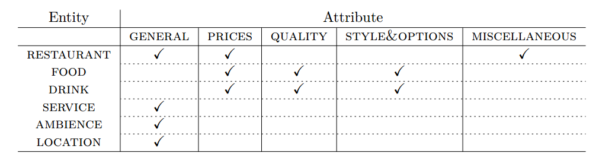
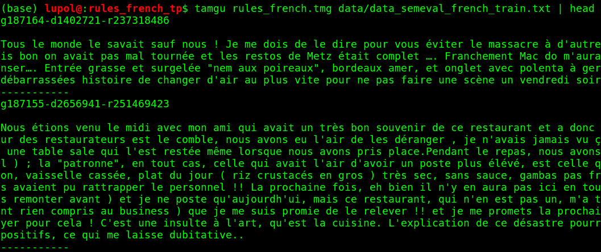
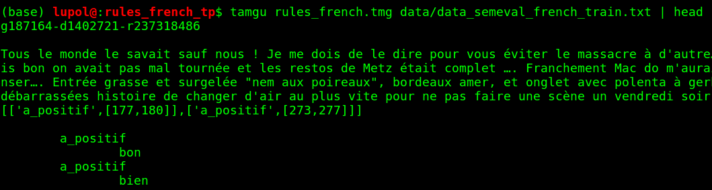

# TP Tamgu

----

## Installation de TAMGU

En cas de problème, référez-vous à la documentation disponible à l'adresse suivante
https://github.com/naver/tamgu/blob/master/README.md#compiling

1) Téléchargez et compilez Tamgu

````
git clone https://github.com/naver/tamgu.git
cd ./tamgu
python install.py
make all
make libs
````

2) Ajoutez les lignes suivantes dans votre bashrc (`~/.bashrc`) en remplaçant `/home/me/tamgu/bin/linux` par le
chemin d'installation sur votre machine:

```
export TAMGULIBS=/home/me/tamgu/bin/linux
export LD_LIBRARY_PATH=$TAMGULIBS:$LD_LIBRARY_PATH
export PATH=$TAMGULIBS:$PATH
```

**Aide**: vous pouvez imprimer en ligne de commande le répertoire de travail actuel en tapant `pwd`, vous pouvez éditer un fichier en utilisant  `gedit myfile` or `vi myfile`.

3) Puis exécutez la commande suivante: `source ~/.bashrc`

Si tout fonctionne correctement il vous suffit de taper `tamgu` pour lancer Tamgu dans votre console.

----

## TP

Nous allons nous inspirer du programme “rules” qui se trouve dans le répertoire “examples”.

Ce programme s’inspire de la [tâche 5](http://alt.qcri.org/semeval2016/task5/) de la campagne d’évaluation [SemEval](http://alt.qcri.org/semeval2016/). Elle consiste à
annoter un ensemble d’avis clients de restaurant en retrouvant plusieurs points dans leurs textes:
_“The goal of this annotation task is to identify opinions expressed within French restaurant reviews
towards specific entities and their attributes”_. Ainsi, il s’agit d’identifier dans le texte l’opinion des
clients vis à vis de différentes entités. Les **entités** correspondent à un ensemble de concepts à
identifier et sont réparties en 6 catégories. Chacune de ces entités peut être décrite selon un certain nombre d’**attributs**, selon le tableau suivant:




Le but de la tâche est de produire des triplets **{entité# attribut#target)** où

- _entité_ correspond au concept retrouvé
- _attribut_ correspond à l’attribut de l'entité dont on parle
- _target_ correspond au mot dans le texte correspondant à l’entité.

Par exemple (vous pourrez trouver d’autres exemple dans le fichier PDF original décrivant la tâche
dans `rules_french/data/ABSA16FR_Restaurants_guidelines.pdf`) :

- _Le service est impeccable, personnel agréable._
    - {service#general#target: service → positive}
- _Pour le reste, cuisine variée, bonne carte de vins, nous reviendrons !_
    - {food#style&options#target: cuisine → positive}
    - {drinks#quality#target: carte de vins → positive}
    - {restaurant#general#target: null → positive}


### Questions
(portants sur le code qui se trouve dans le répertoire `tamgu/examples/rules`)

Pensez à consulter la documentation de Tamgu pour répondre au mieux aux questions
(https://github.com/naver/tamgu/blob/master/docs/tamgu.pdf)

- **Q0 :** Lancez le programme _rules.tmg_ et observez la sortie.
    Que signifient les lignes du type `['a_resto',[86,91]]` ?
- **Q1 :** Ouvrez le fichier _lexicon.tmg_.
    Que contient-il? Que signifie la syntaxe `@X ← Y`.?
- **Q2 :** Ouvrez le fichier _rules.tmg_.
    - Q2.1 Quelle est la signification de la ligne 15 ( `a_neutral ← #neutral+.` )?
    - Q2.2 Quelle est la significiation de la ligne 17 (`a_negative ← not,?*:3,#positive.`)?
    - Q2.3 Quelle règle permet de capturer la séquence suivante “lemon chicken with almonds from the US”. Expliquez-la.
- **Q3 :** Au vu des questions précédentes, expliquez ce qui permet de faire un objet de type _annotator_ en Tamgu

Nous allons désormais essayer de faire un système équivalent pour des critiques de restaurant
écrites en français. Nous vous fournissons une structure de code dans le fichier _rules_french.zip._
Contrairement au programme _rules.tmg_ , notre programme devra lire les critiques utilisateurs à partir
d’un fichier texte ( _data_semeval_french_train.txt_ )

- **Q4 :** Ouvrez le fichier _utils.tmg_
    Écrivez une fonction readFile qui prend comme argument d’entrée un chemin vers un fichier
    et renvoie une table de hashage (équivalent à un dictionnaire en Python) ayant pour clef
    l’identifiant de l’avis client et pour valeur le texte de l’avis client.

> Vérifiez que votre code fonctionne en lançant le programme `rules_french.tmg` avec les data _semeval_. Vous devriez voir s’afficher l’identifiant de l’avis client puis l’avis client sur les lignes suivantes (comme dans la figure suivante)




- **Q5 :** Dans le fichier _rules_french.tmg_ , déclarez un objet de type _annotator_ ayant pour nom _annot_sent._ Faites en sorte qu’il soit capable de parser les règles d’annotations     _sentiment_ définies dans le fichier _annotation_rules_french.tmg_
- **Q6 :** Rajouter les instructions nécessaires pour que votre annotateur parse les avis clients et qu’il affiche un résultat semblable à celui-ci :


- **Q7 :** On souhaiterait désormais obtenir un affichage plus clair pour l’utilisateur, afin que s’affiche clairement quels mots ont été repérés. Faites en sorte d’obtenir l’affichage suivant:



- **Q8 :** Pour améliorer notre annotateur, nous allons lui ajouter un lexique. Le lexique est géré par un transducteur qui est ensuite associé à notre annotateur avec la méthode _lexicon()_. Faites en sorte que votre annotateur se serve du lexique _french.tra_. Quelles différences observez-vous dans les mots repérés? Quels sont les mots qui sont désormais repérés qui ne l’étaient pas avant?

- **Q9 :** Notre annotateur est plutôt basique et l’on aimerait qu’il annote de manière un peu plus intelligente. En effet, dans la phrase suivante “ _Du surgelé mais du surgelé pas bon_ ”, “ _bon_ ” sera annoté comme positif. Modifiez les règles d’annotation dans _annotation_rules_french.tmg_ pour faire en sorte que cela n’arrive pas. Pensez aussi au fait qu’éventuellement plusieurs mots peuvent être entre “ _pas_ ” et “ _bon_ ” comme dans “pas _très_ bon”.

- **Q10 :** Faites en sorte que votre programme puisse également repérer les mots relatifs aux entités Nourriture, Boisson, Service et Ambiance et qu’il repère des attributs relatifs au Prix et à la Qualité. Pour cela, rajoutez le vocabulaire nécessaire dans _lexicon_french.tmg_ , les règles nécessaires dans _annotation_rules_french.tmg_ et un annotateur dans le fichier _rules_french.tmg._ A vous de définir au mieux le vocabulaire et les règles pour capturer un maximum d’éléments.
- **Q11 :** Pour l’instant l’annotation est faite à l’échelle du texte entier ce qui n’est pas idéal pour retrouver les triplets. Nous allons donc séparer le texte de l’utilisateur en phrases et passer celle-ci une à une à l’annotateur. De la sorte, nous auront une sortie relativement proche des triplets désirés (même si les sorties ne seront pas explicitement des triplets). Pour éviter au maximum les erreurs, nous allons nous servir des capacités de tokenisation du transducteur gérant le vocabulaire.
  - Q11.1 Faites tokenizer le texte par le transducteur et affichez les tokens. Parfois, certains éléments de la liste de retour sont constitués de deux éléments (comme ['restaurant','restaurer'] ou ['du','de'] ou bien encore ['typiques','typique']). A quoi correspond le premier élément? A quoi correspond le second?
  - Q11.2 Quel est l’avantage d’utiliser le tokenizeur du transducteur plutôt que de faire une tokenization naïve sur les espaces? Regardez comment sont traitées les séquences de mots “en permanence” et “pomme de terre”. Combien de tokens a-t-on pour ces séquences là? Combien en aurait-on eu avec une tokenization naïve?
  - Q11.3 Reconstituez des phrases à partir des tokens en considérant les caractères de ponctuation comme des fins de phrases. Quels caractères de ponctuation avez-vous sélectionnés?
- **Q12** Modifiez le lexique et les règles de sorte d’obtenir les meilleurs triplets par phrase. Une fois que vous pensez avoir fini, testez votre programme sur le fichier _./data/data_semeval_french_test.txt_.

## CR
Vous rendrez votre TP sous forme d’un fichier ZIP contenant l’ensemble de votre programme fonctionnel ainsi qu’un fichier _sortie_test.txt_ contenant les sorties de votre programme sur le fichier de test.